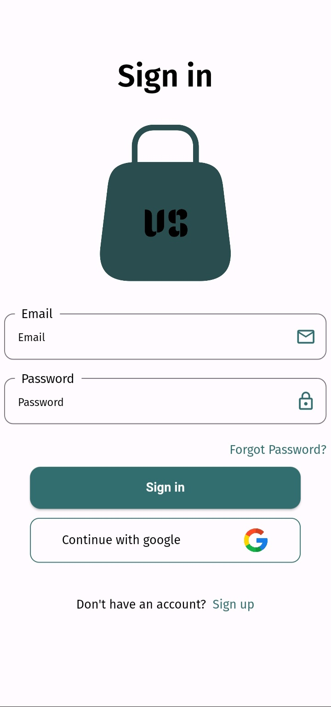
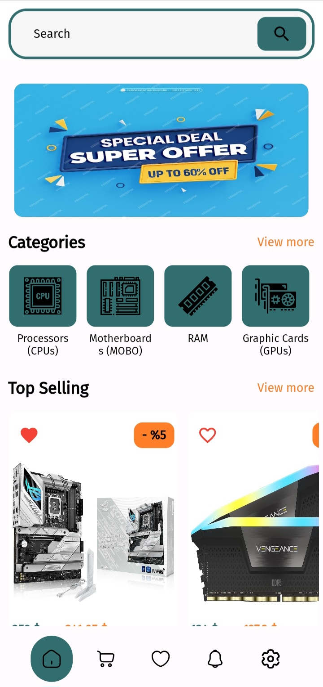
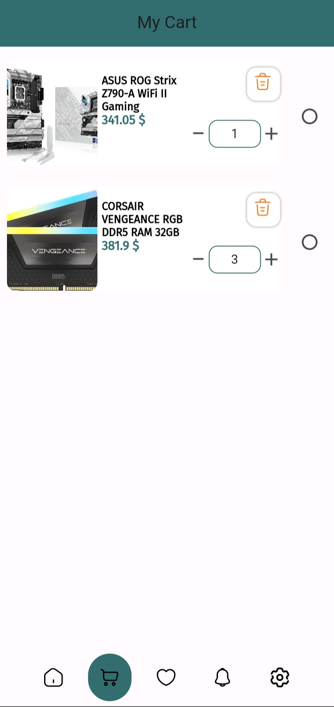
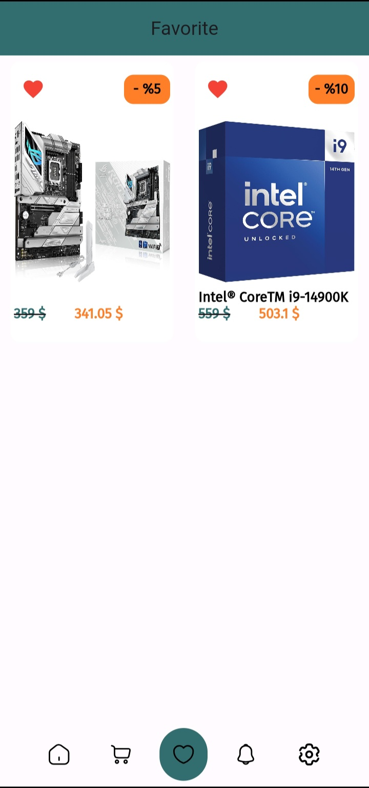
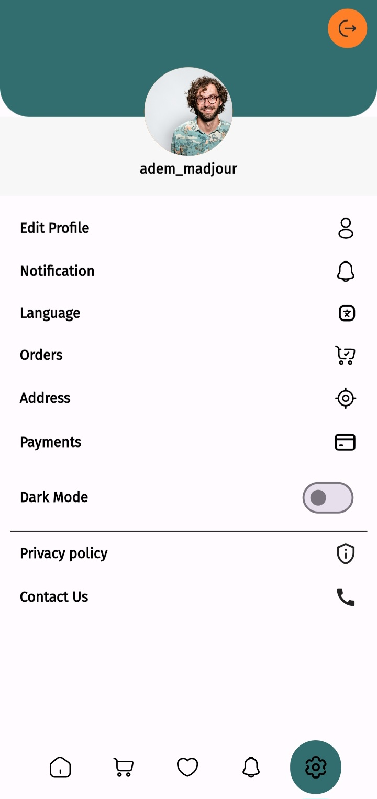

# ️ Ecommerce Application

Welcome to Volva Shop!

This is an e-commerce application that provides a seamless online shopping experience for customers. It features a user-friendly interface, secure payment options, and a wide range of products to choose from.

## Features ✨

Intuitive product browsing and search functionality

Detailed product pages with images, descriptions

Shopping cart with effortless quantity adjustments

Secure checkout process with multiple payment gateways

User account management for order history, wishlists, and address book

Responsive design for optimal viewing on all devices

**## Technologies Used **

Frontend: flutter / Dart

Backend: PHP 

Database: Mysql

Payment Gateway: stripe

## Screenshots ️

## Contact ✉️

For any questions or feedback, please reach out to adem madjour at madjour.adem@gmail.com .

## Notice 🔔 
run this code on terminal when you open the project : flutter pub get 
 